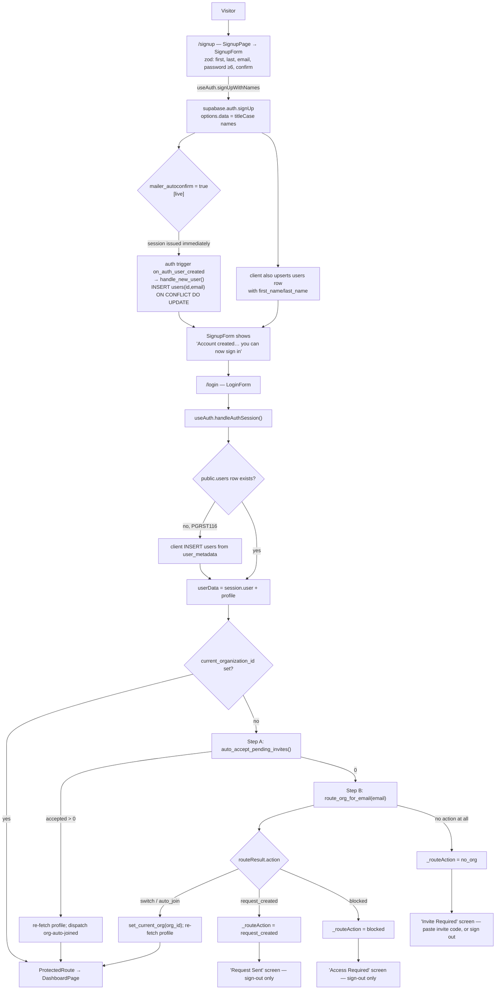
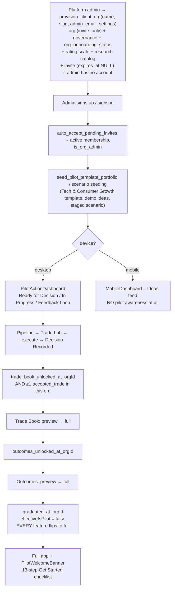
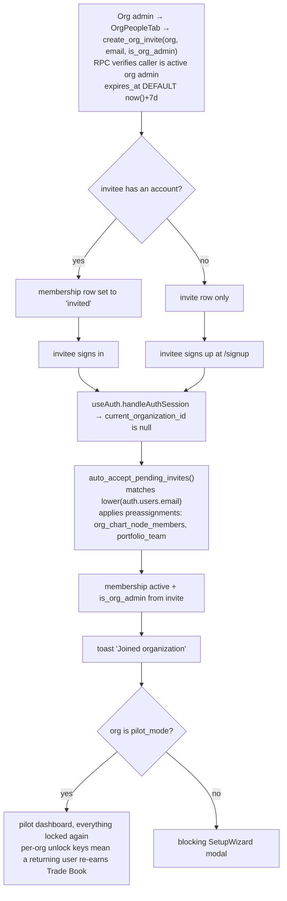
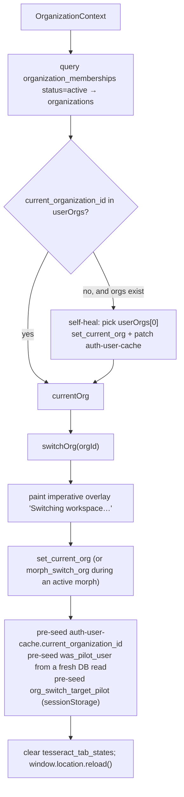

# Access, Signup, Onboarding, Workspace & Entitlement Audit

> **Status note:** some findings below have been closed since this was
> written. See [`AUDIT-STATUS-2026-08-30.md`](./audit/AUDIT-STATUS-2026-08-30.md) before acting on any of
> them. Nothing in this document has been edited — the note tracks status
> separately so the original assessment stands as written.

**Branch:** `audit/access-onboarding`
**Date:** 2026-08-27
**Scope:** signup → auth → profile → org → membership → role → pilot → onboarding → first value; workspace/individual/enterprise model; entitlement architecture; packaging recommendation; first-engagement / progressive-unlock review (desktop, mobile, cross-device).
**Status:** audit and design only. No product code changed, no schema changed, no billing built.

Every claim below is derived from the code on this branch or from a live read of
the production Supabase project (`wfcebeagznzgeuyysbnt`) via the Management API,
because migrations are known not to describe production. Production reads are
marked **[live]**.

---

## 0. Executive summary

The product has a **professional multi-tenant workspace** that works, and a
**consumer-shaped public signup form** bolted to the front of it that leads
nowhere. Between them sits a pilot progressive-unlock system that was correct for
a staged demo and is now the single largest source of complexity in the app shell.

Six findings dominate everything else:

1. **Public signup is open and unverified, and terminates in a wall.**
   `disable_signup=false`, `mailer_autoconfirm=true` **[live]**. Anyone can create
   a confirmed account with any email address they do not control. There are zero
   verified org domains **[live]**, and all 27 orgs are `invite_only` **[live]**,
   so `route_org_for_email` returns `blocked/no_match` for every unsolicited
   signup and the user lands on "Invite Required" holding a real session.
2. **Unverified email + auto-accept invites is an invite-hijack path.**
   `auto_accept_pending_invites()` matches on `auth.users.email` with no proof of
   control, and `organization_invites.invited_is_org_admin` can grant org admin.
   6 invites are pending today **[live]**. See §5 P0-1.
3. **A solo professional cannot exist.** `coverage` is INSERT-admin-only at the RLS
   layer (`coverage_insert_admin_only: is_coverage_admin()`) **[live]**, org
   creation was removed from the UI, and onboarding's second step asks you to
   request access to org-chart nodes. The product currently assumes somebody else
   set your workspace up. Only 4 of 26 users have any coverage rows **[live]**.
4. **There is no entitlement layer at all** — zero plan/tier/subscription tables,
   zero `plan === '…'` branches. This is good news: the design space is clean, and
   exactly one resolved-limit service already exists (`platform_ai_config` →
   `user_ai_config` overrides in `ai-chat`) that is the right pattern to generalise.
5. **The pilot lock system should be removed as a lock system and kept as a
   sequence.** It buys roughly one session of focus and costs permanent
   architectural drag: ~20 commits of flicker/cold-load/self-heal fixes, four
   localStorage caches, and a mobile inconsistency where the nav drawer offers six
   surfaces the route guard silently bounces you off.
6. **Mobile has no onboarding at all, and is the better onboarding surface.**
   `MobileDashboard` (the Ideas feed) contains no pilot gating, no welcome, no Get
   Started. It is already the "ideas-first landing" the desktop wants to become.

**Packaging recommendation: (A) professional early access only — but build the
workspace-of-one primitive and the entitlement resolver now.** Do not publish
tiers, do not build a free tier, do not build billing. Evidence in §10.

**Next PR: PR-1, "Close the signup dead end."** Details in §17.

---

## 1. Current signup diagram

### 1.1 The actual code path



### 1.2 What actually happens today for a real unsolicited signup

Because **0 organization_domains are verified** and **all 27 orgs are
`invite_only`** **[live]**, `route_org_for_email` can only return:

| Branch in `route_org_for_email` | Reachable today? |
|---|---|
| `switch` (exactly 1 active membership) | only for an already-invited user |
| `switch` (verified domain + already member) | **no** — 0 verified domains |
| `auto_join` (verified domain + `onboarding_policy='open'`) | **no** — 0 verified domains, 0 open orgs |
| `request_created` (verified domain + `approval_required`) | **no** — same |
| `blocked` (verified domain + `invite_only`) | **no** — same |
| `blocked / no_match` | **yes — this is the only outcome** |

So: **100% of public signups not preceded by an invite terminate on the "Invite
Required" screen**, holding a valid confirmed session and an orphaned
`public.users` row. Two such orphans exist today **[live]**.

### 1.3 Persisted fields written along the way

| Field | Table | Written by |
|---|---|---|
| `id, email` | `public.users` | `handle_new_user()` trigger **and** two separate client paths |
| `first_name, last_name` | `public.users` | client only — the trigger does not carry metadata |
| `current_organization_id` | `public.users` | `set_current_org()`, `bootstrap_organization()`, `maintain_current_org_on_membership_change` trigger |
| `user_type` (default `'Investor'`, capitalised) | `public.users` | SetupWizard completion |
| `user_type` (`investor`/`operations`/`compliance`, lowercase) | `user_profile_extended` | SetupWizard step 1 |
| `is_pilot_user`, `pilot_progress` | `public.users` | ops panel / `usePilotProgress.markStage` |
| membership + `is_org_admin` | `organization_memberships` | `accept_org_invite`, `auto_accept_pending_invites`, `route_org_for_email`, `provision_client_org` |
| `wizard_completed, current_step, steps_completed` | `user_onboarding_status` | SetupWizard only |
| `is_completed, current_step` | `org_onboarding_status` | `provision_client_org` creates the row; `ClientOnboardingWizard` (unreachable) would complete it |

### 1.4 Redirect / completion gates, in evaluation order

1. `AppRoutes` — `loading` → app loader; `/signup` and `/login` redirect to
   `/dashboard` if `user` is truthy (note: truthy from the **localStorage cache**,
   before the profile resolves).
2. `ProtectedRoute` — `!user` → `/login`; `isRecoverySession` → `/update-password`;
   `_routeAction === 'blocked'` → Access Required; `'request_created'` → Request
   Sent; `!hasOrg` → Invite Required.
3. `DashboardPage` — `pilotMode.isInitialResolve` → neutral skeleton; org-transition
   gate; `needsOnboarding` → **blocking full-screen SetupWizard modal**; pilot tab
   filter; pilot route guard; per-tab preview substitution.

### 1.5 Dead or contradictory code found on the signup path

| Item | State | Evidence |
|---|---|---|
| `src/contexts/AuthContext.tsx` | **dead** — a second, divergent auth implementation. No `AuthProvider` is mounted; only a test mock references it. Its `SIGNED_IN` handler would create a `users` row with no names. | `grep AuthProvider` → only its own definition |
| `src/pages/SetupWizardPage.tsx` | **dead** — route replaced with `<Navigate to="/dashboard">` | `src/App.tsx:16,79-81` |
| `src/components/onboarding/ClientOnboardingWizard.tsx` (1,190 lines) | **dead** — nothing renders it | `src/components/ProtectedRoute.tsx:10-12` |
| `useOnboarding().shouldShowWizard`, `.isFirstTime`, `.initializeOnboarding` | **dead exports** — nothing imports them | `grep` returns only the hook |
| `public.user_capabilities` | migration exists, **table does not exist in production** **[live]** | `supabase/migrations/20260201100004_create_user_capabilities.sql` |
| `bootstrap_organization()` | **live and EXECUTE-granted to `authenticated`** **[live]**, no platform-admin check. Org creation is disabled only in the UI. | `pg_proc.proacl` |
| SSO / SAML UI (`SsoCallbackPage`, `OrgIdentityProviderSection`, `get_identity_provider_for_email`) | **non-functional** — `saml_enabled=false` **[live]** | project auth config |

---

## 2. Current pilot onboarding diagram

Pilot-ness is **org-scoped only**: `organizations.settings.pilot_mode`
(`usePilotMode`, migration `20260424110000_pilot_mode_org_only`). `users.is_pilot_user`
survives as a legacy column with 1 row set **[live]** and is not read.



Separately, and independently of pilot state, **non-pilot** users hit the
**blocking 5-step SetupWizard modal** (`DashboardPage:346-352`, rendered at
`:1428-1438`): Profile → Teams & Access → Your Focus → Data & Tools → Review.

### 2.1 Pilot funnel, live

| Metric | Value **[live]** |
|---|---|
| Orgs | 27 (26 `pilot_mode`, all `invite_only`) |
| Orgs with a `pilot_access` override | **0** — every pilot org runs `PILOT_ACCESS_DEFAULTS` |
| Users | 26 (2 with no org) |
| Users with any `pilot_progress` | 10 |
| …reached `trade_book_unlocked` | 6 |
| …reached `outcomes_unlocked` | 6 |
| …`graduated` | 7 |
| `user_onboarding_status` rows | 13, **all** `wizard_completed` |
| `org_onboarding_status` rows | 27, 26 completed |
| Users with ≥1 `coverage` row | **4** |
| Portfolios / holdings / ideas / accepted_trades | 36 / 1,086 / 228 / 52 |

Read carefully: of the 10 users who started the pilot loop, 7 finished it. The
loop **works**. What the numbers also say is that 16 of 26 users never entered it,
and that coverage — the concept the target onboarding wants to lead with — is
touched by 4 people.

---

## 3. Invited-user flow



**There is no invite email.** `create_org_invite` writes a row and returns a token;
no mailer is wired. Delivery is out-of-band, and the fallback UI is a
paste-the-code box on the "Invite Required" screen (`ProtectedRoute:160-200`).

**There is no invite landing route.** `/invite/:token` does not exist. A link in a
future invite email has nowhere to point.

---

## 4. Multi-org flow



Multi-org is real but rare: 20 users have 1 org, 3 have 2, 1 has 3 **[live]**.
Org switching costs a **full page reload** by design (the comment in
`OrganizationContext` records that surgical invalidation produced stuck loaders).

Divergence worth naming: pilot unlock state is keyed per-org
(`trade_book_unlocked_at_<orgId>`, ADR-002) but stored in a **user-level** JSONB
column. It works; it also means a pilot's progress is not deletable with their
membership.

---

## 5. Friction inventory — ranked

### P0 — must fix before any broader professional access

**P0-1 · Unverified email + auto-accept invite = account/invite hijack.**
`mailer_autoconfirm=true` **[live]** means signup issues a confirmed session with
no proof of email control. `auto_accept_pending_invites()` then matches pending
invites on `lower(auth.users.email)` and grants an **active membership**, with
`is_org_admin` taken from the invite. Registering an address that has a pending
invite is sufficient to enter that workspace. 6 pending invites exist today
**[live]**. Fix: require email confirmation before any invite accept — the check
belongs on the accept path, not only on signup.
*Files:* project auth config; `auto_accept_pending_invites`; `accept_org_invite`.

**P0-2 · Public signup is open and terminates in a wall.**
`disable_signup=false` **[live]**, 0 verified domains, 27/27 `invite_only`. Every
unsolicited signup produces an orphan `public.users` row and a dead-end screen.
The signup form says "Account created successfully! You can now sign in." — which
is true and useless.

**P0-3 · Skipping the SetupWizard does not persist.**
`onSkip={() => setOnboardingDismissed(true)}` is React state
(`DashboardPage:1428-1438`, `:346-352`). `needsOnboarding` is recomputed from
`!onboardingStatus?.wizard_completed`, and **no row exists until the wizard writes
one**. A non-pilot user who exits setup is re-blocked by a full-screen modal on
every reload, forever. 13 of 26 users have no `user_onboarding_status` row **[live]**.

**P0-4 · A solo professional cannot establish coverage.**
`coverage_insert_admin_only` requires `is_coverage_admin()` **[live]**. There is no
self-serve path to say "I cover these 20 names." This blocks the target onboarding
in §7, blocks the workspace-of-one model in §8, and is why only 4 users have
coverage. It is an RLS predicate, so no amount of UI work routes around it.

**P0-5 · Mobile offers surfaces the route guard silently revokes.**
`MobileNavDrawer` renders `MOBILE_SURFACES` with `inNav: true`, which includes
`coverage`, `calendar`, `charting`, `files`, `priorities`, `projects-list` — all
`'hidden'` in `PILOT_ACCESS_DEFAULTS`. Tapping one opens the tab; the shared pilot
route guard (`DashboardPage:255-281`) snaps back to the home tab with **no
explanation** (the `pilot-teaser` modal only fires from desktop `Header` clicks).
On a phone this reads as the app being broken.

### P1 — fix before broader launch

**P1-1 · Two competing "is this user onboarded?" predicates.** `useOnboarding`
exports `shouldShowWizard` (requires a row to exist, so it never fires for new
users) — and it is dead. `DashboardPage` uses its own inverted predicate. Only one
should exist.

**P1-2 · Two `user_type` fields with different vocabularies.** `users.user_type`
(`'Investor'`, capitalised, DB-constrained) and `user_profile_extended.user_type`
(`'investor'`, lowercase). `resolveOrgRole` reads the second, with a legacy array
fallback. Role resolution is spread across a boolean (`is_org_admin`), another
boolean (`coverage_admin`), a text column (`memberships.role`), a FK
(`memberships.role_id` → `user_role_definitions`), and two `user_type` fields.

**P1-3 · Profile creation is triple-implemented and client-dependent.**
`handle_new_user()` inserts `(id,email)` only; names come from two separate client
writes. A signup that closes the tab mid-flight yields a nameless profile.

**P1-4 · Onboarding step 2 ("Teams & Access") is empty for a new workspace.** It
queries org-chart nodes and portfolios to request access to. A freshly provisioned
org has neither until seeding runs.

**P1-5 · No invite email, no invite landing route.** §3.

**P1-6 · SSO UI with no SSO.** `saml_enabled=false` **[live]** while the app ships
an identity-provider config section, an SSO callback route, and an anon-callable
`get_identity_provider_for_email`. Enterprise buyers will read this as a capability.

**P1-7 · `bootstrap_organization` is callable by any authenticated user** **[live]**,
with no platform-admin check; org creation is "disabled" only by removing the
route. Either the RPC enforces the policy or the policy changes.

**P1-8 · Blocking modal is the wrong shape on a phone.** The SetupWizard renders
into `max-w-3xl h-[90vh]` with a horizontal CSS-grid stepper — desktop geometry,
no mobile treatment.

### P2 — worth doing, not blocking

- **P2-1** Dead code: `contexts/AuthContext.tsx`, `SetupWizardPage`,
  `ClientOnboardingWizard` (1,190 lines), three dead `useOnboarding` exports,
  `users.is_pilot_user`, the `user_capabilities` migration with no table.
- **P2-2** `password_min_length: 6`, no captcha **[live]**, on a product that will
  hold client holdings.
- **P2-3** The pilot state machine maintains four localStorage caches
  (`was_pilot_*`, `has_committed_trade_*_*`, `pilot_graduated_*_*`,
  `org_switch_target_pilot`) plus an auth-cache merge, purely to suppress flicker.
- **P2-4** Ideas feed has no cold-start empty state — the only empty render is
  "No tiles match this filter" (`MobileDashboard.tsx:4393`), wrong copy for a
  workspace with no content.
- **P2-5** `organization_invites.expires_at` still defaults to 7 days; pilot
  provisioning explicitly passes `NULL` to dodge it. The default is a trap for
  every other caller.

---

## 6. KEEP / CHANGE / REMOVE / DEFER

### 6.1 Signup & access

| Step / element | Verdict | Rationale |
|---|---|---|
| `/signup` public form | **CHANGE** | Keep the route; make it lead to a workspace-of-one instead of a wall. |
| Email autoconfirm | **CHANGE → require verification** | P0-1. |
| First/last name at signup | **KEEP** | Cheap, used everywhere, right place to ask. |
| Password ≥6, no captcha | **CHANGE** | ≥10 + rate limit before broader access. |
| Client-side profile creation | **CHANGE** | Move names into `handle_new_user()` via `raw_user_meta_data`; make the client path a fallback, not the source. |
| `contexts/AuthContext.tsx` | **REMOVE** | Dead, divergent, dangerous if ever mounted. |
| "Invite Required" paste-a-code screen | **KEEP** | Genuinely useful; keep as the fallback once invite links exist. |
| "Access Required" / "Request Sent" screens | **KEEP** | Correct for enterprise domain policies. Unreachable today only because no domain is verified. |
| `route_org_for_email` domain routing | **KEEP** | Well-built; it is the enterprise-provisioning primitive, simply unexercised. |
| `bootstrap_organization` unguarded | **CHANGE** | Enforce the policy in the RPC. |
| SSO/SAML UI | **DEFER** (and hide) | Ship it with the backend, not before. |
| `/invite/:token` route + invite email | **ADD** | P1-5. |

### 6.2 SetupWizard (non-pilot, blocking, 5 steps)

| Step | Verdict | Rationale |
|---|---|---|
| Blocking full-screen modal | **REMOVE** | Nothing here is required to render the product. It is a tax collected before value. |
| 1 · Profile (`title`, `user_type`) | **CHANGE → keep only role, one screen post-signup** | `user_type` is the only field with downstream behaviour (`resolveOrgRole`). One field, one vocabulary. |
| 2 · Teams & Access | **REMOVE** | Empty for new workspaces; access requests belong in Organization, on demand. |
| 3 · Your Focus (style, horizon, cap, geo, sector, asset class, universe, tickers, description) | **CHANGE → DEFER most, keep sector/ticker seeding** | A 30-field questionnaire before first value. The only parts that can feed the Ideas feed are sectors and tickers — and those should be captured as **coverage**, not a profile blob. |
| 4 · Data & Tools (provider, 5 toggles, notes) | **REMOVE from onboarding** | Zero product effect today; it is sales discovery. Move to Settings or to a founder conversation. |
| 5 · Review | **REMOVE** | Reviewing a form you were forced to fill is not value. |
| `user_onboarding_status` table | **KEEP, repurpose** | Becomes the canonical cross-device onboarding state (§12.3). |
| `user_profile_extended` (30+ columns) | **DEFER** | Do not delete; stop gating on it. Most columns are unread. |

### 6.3 Pilot system

| Element | Verdict | Rationale |
|---|---|---|
| `pilot_mode` org flag | **KEEP** | Cheap, org-scoped, correct. Becomes a *grandfather entitlement grant* (§9.6). |
| Seeded scenario / template portfolio / demo ideas | **KEEP — the best thing in the onboarding** | It is why a pilot's first session has content. Generalise it: every new workspace should land with something to look at. |
| `PILOT_ACCESS_DEFAULTS` `'hidden'` locks | **REMOVE** | §11. |
| `'preview'` substitution (Trade Book / Outcomes) | **CHANGE → keep as empty-state, drop as a lock** | The preview components are good *empty states*. Show them because there is no data, not because the user is unworthy. |
| `pilot_progress` per-org stage keys | **CHANGE → generalise** | Rename to workspace-agnostic activation milestones; keep per-org keying (ADR-002 is right). |
| Get Started checklist (13 steps) | **CHANGE → shorten to 3–4** | 13 steps is a scavenger hunt; "Use a prompt" / "Recommend a user" are engagement metrics wearing an onboarding costume. |
| `PilotActionDashboard` | **KEEP, rename** | A "what needs a decision" routing dashboard is right for everyone, not just pilots. |
| `PilotGraduationModal` | **KEEP** | Genuinely good moment; retarget at first *captured decision*. |
| Four localStorage pilot caches | **REMOVE with the locks** | They exist only to stop lock-state flicker. |
| `users.is_pilot_user` | **REMOVE** | Legacy, unread, 1 row. |
| `ClientOnboardingWizard`, `SetupWizardPage` | **REMOVE** | Dead. |

### 6.4 Coverage / portfolio

| Element | Verdict | Rationale |
|---|---|---|
| `coverage` as the organising concept | **KEEP — promote it** | It is the one input that makes the Ideas feed personal. |
| `coverage_insert_admin_only` RLS | **CHANGE** | Allow a user to insert coverage **for themselves** in their current org. Keep admin-only for assigning *others*. P0-4. |
| Coverage as an onboarding *step* | **CHANGE → make it an in-feed action** | "Do you cover this?" on an idea card beats a coverage picker screen. |
| Portfolio creation in onboarding | **DEFER** | Optional. Holdings upload is a real project; never put it before first value. |
| Seeded template portfolio | **KEEP** | Fastest path to a non-empty feed. |

---

## 7. Target onboarding

Principle: **decide nothing before you have seen something true.**

```
signup (email, name, password, verify)
  → workspace exists already (one member, you)          ← no decision
  → one screen: "What do you work on?"                  ← ONE decision
      sectors, or paste/upload tickers  → writes coverage rows
      (skippable; skipping seeds a demo book)
  → Ideas feed, populated                                ← FIRST VALUE
      each card explains why it surfaced
      each card offers: act · capture a view · not my name
  → first captured judgment                              ← ACTIVATION
      → "Decision recorded" moment
      → contextual introduction of the next capability
  → everything else, on demand, forever unlocked
```

### 7.1 Individual professional, joining alone

| Phase | What happens |
|---|---|
| signup | Email + verify. On verify, `provision_personal_workspace()` creates an `organizations` row with `kind='personal'`, an admin membership, and sets `current_organization_id`. No org-creation UI, no naming decision — the workspace is named after them and renameable later. |
| onboarding | One screen: coverage. Sector chips + a ticker paste box. "Skip" is a first-class button that seeds the template book. |
| first value | Ideas feed with cards about names they just claimed. |
| later | Portfolio/holdings, teams, invites, integrations — reached from the product, never as a gate. |

### 7.2 Invited teammate

| Phase | What happens |
|---|---|
| signup | Invite email → `/invite/:token` → signup or sign-in → `accept_org_invite`. Email must match, and must be verified. |
| onboarding | **No coverage screen.** The workspace already has portfolios, org structure, coverage. Show "You've joined *Firm*. Here's what your team is working on." Preassignments already place them in nodes/portfolios. |
| first value | Ideas feed scoped to their team's book on the first paint. |
| later | Their own coverage, added from feed cards. |

### 7.3 Existing pilot

| Phase | What happens |
|---|---|
| login | Nothing changes; no new onboarding. |
| migration | Locks lift silently (§13). Already-graduated users see a no-op. Mid-loop users gain access rather than lose it — strictly additive, no announcement required. |
| later | The Get Started checklist is replaced by the shortened version; completed steps map forward. |

### 7.4 Enterprise-provisioned user

| Phase | What happens |
|---|---|
| signup | SSO (when built) or verified-domain routing — both already exist as code paths and need only a verified domain + `onboarding_policy`. |
| onboarding | None. Role, teams, portfolios, coverage come from provisioning/preassignments. |
| first value | Feed scoped by assigned coverage on first login. |
| later | Admin surfaces gated by entitlement, not by plan-name checks. |

---

## 8. Target workspace architecture

**One workspace primitive. No second product.** The evidence says this is already
almost true, and the archived `docs/archive/personal-tier-spec.md` reached the same
conclusion (§2 Decision A) before being shelved for reasons that applied to its
*public feed*, not to its workspace model.

```
individual professional  =  organizations row, kind='personal', 1 active membership
        │  invite a colleague (create_org_invite — already exists)
        ▼
collaborative workspace  =  same row, N memberships, teams, shared coverage
        │  domain verification + onboarding_policy + SSO + governance
        ▼
enterprise workspace     =  same row + governance/audit/integrations,
                            all of which are already separate tables
```

### 8.1 What already works

- Multi-tenancy via `organization_id` + RLS, with a lint guard
  (`npm run tenant:lint:all`) — 279 migrations of investment; do not disturb it.
- Multi-org membership + switching (`OrganizationContext.switchOrg`).
- Invites with preassignments to org-chart nodes and portfolios.
- Domain routing with three policies (`open`, `approval_required`, `invite_only`).
- Governance as separate tables (`organization_governance`, `organization_audit_log`,
  `organization_domains`, `organization_identity_providers`, `org_export_jobs`).
- Per-org AI config and BYOK.
- Org archival as a read-only state (`useOrgWriteEnabled`) — a working precedent
  for a **non-destructive restricted mode**, which is exactly what downgrade needs
  (§14).

### 8.2 What needs to change

| # | Change | Why |
|---|---|---|
| 1 | `organizations.kind` (`'personal' \| 'firm'`), default `'firm'` | Lets personal workspaces differ in UI without a second code path. Additive column. |
| 2 | `provision_personal_workspace()` RPC | One-member workspace at verify time. `bootstrap_organization` is 80% of it already — it needs a policy guard and a personal branch, not a rewrite. |
| 3 | Self-coverage RLS | P0-4. `coverage_insert_own` alongside `coverage_insert_admin_only`. |
| 4 | Collapse role representation | One `role` concept on membership, with `is_org_admin`/`coverage_admin` derived, not parallel. |
| 5 | Entitlements layer | §9. |
| 6 | Personal→team promotion | Renaming a personal workspace + inviting = promotion. One explicit action that flips `kind` and prompts for a real name. |

### 8.3 Expensive-to-reverse decisions

| Decision | Reversal cost | Recommendation |
|---|---|---|
| **Personal user = organization of one** | **Low if chosen now, very high if not.** Choosing "org-less personal mode" later means auditing every `organization_id` predicate across 279 migrations for NULL handling. | **Decide now: org of one.** |
| Entitlements owned by workspace, not user | High — every check site changes | **Workspace-owned, with user-scoped overrides.** Matches how firms buy. |
| Entitlement resolution server-side vs client | Very high — client-side entitlements are unenforceable and become a security rewrite | **Server-side resolver is the source of truth; the client hook is a rendering convenience.** |
| Per-org keying of activation state (ADR-002) | Already paid for | **Keep.** |
| Full-reload org switch | Medium | **Keep** — the comment records that surgical invalidation failed. |
| Deleting data on downgrade | Catastrophic and irreversible | **Never.** Restricted mode (§14). |
| Publishing public price tiers | High — public pricing is very hard to raise | **Do not publish yet** (§10). |
| Building a second consumer app | Highest | **No.** No evidence supports it. |

### 8.4 Does anything in the pilot structure block this model?

Only one thing, and it is soft: **pilot unlock state lives in a user-level JSONB
column keyed by org.** It is not a blocker; it is a cleanup. Everything else about
pilot is an org setting, which is exactly where a grandfather entitlement wants to
live.

### 8.5 Do individual and enterprise require separate products?

**No.** The only structural difference is who administers the workspace and how
many members it has. Governance, audit, SSO, and integrations are already
*separate tables joined to `organizations`*, which means "enterprise" is additive
rows, not a different schema. The one genuine tension — an individual's record
following them between employers — is solved by multi-org membership, which
already works.

---

## 9. Entitlement architecture

### 9.1 The rule

`if (plan === 'enterprise')` must never appear in a component. Components ask
**capability** questions. Plans are one of several *sources* that answer them.

```tsx
const { allowed, limit, used, reason } = useEntitlement('max_coverage_assets')
```

### 9.2 Resolution order

There is already exactly one resolved-limit service in the codebase, and it has
the right shape — `supabase/functions/ai-chat/index.ts:377-390` resolves
`platform_ai_config` defaults against `user_ai_config` overrides. **Generalise
that**; do not invent a parallel mechanism.

```
6. pilot / grandfather grant     ← highest: never take away what a pilot has
5. administrator override        ← platform staff, time-boxed, audited
4. user entitlement              ← per-seat differences inside a workspace
3. workspace entitlement         ← contract terms, org admin allocations
2. plan template                 ← named bundle, resolved to values, never branched on
1. platform default              ← the floor
```

Higher layers win per key. Every layer carries `source` and `expires_at`, so "why
can I do this?" is always answerable — which is what makes enterprise contract
terms safe.

### 9.3 Shape

```sql
-- Named bundles. A plan is DATA, never a branch.
plan_templates(
  key text primary key,             -- 'early_access' | 'pro' | 'team' | 'enterprise'
  display_name text,
  capabilities jsonb not null,      -- { can_use_api: false, max_members: 1, ... }
  is_public boolean default false   -- false until we decide to publish (§10)
)

-- What a workspace is entitled to. One row per (workspace, key).
workspace_entitlements(
  organization_id uuid,
  key text,
  value jsonb not null,             -- true/false or a number
  source text not null,             -- 'plan' | 'contract' | 'grandfather' | 'admin_override' | 'trial'
  granted_by uuid, granted_at timestamptz, expires_at timestamptz, note text,
  primary key (organization_id, key)
)

-- Per-seat deviations inside a workspace.
user_entitlements(
  user_id uuid, organization_id uuid, key text,
  value jsonb not null, source text not null,
  granted_by uuid, expires_at timestamptz,
  primary key (user_id, organization_id, key)
)

-- Which bundle a workspace is on. No Stripe. A pointer and a state.
organizations.plan_key    text default 'early_access'
organizations.plan_state  text default 'active'   -- active|trial|past_due|restricted
```

One resolver, server-side, authoritative:

```sql
resolve_entitlements(p_user_id uuid, p_org_id uuid) returns jsonb
-- platform defaults ← plan_templates[org.plan_key] ← workspace_entitlements
-- ← user_entitlements ← admin_override ← grandfather
```

Client:

```ts
useEntitlements()                    // one query, cached per (user, org)
useEntitlement('can_use_api')        // { allowed, limit, used, reason, source }
<Entitled cap="can_use_api">…</Entitled>
```

**Enforcement is server-side.** Limits that cost money (AI tokens, API calls,
exports) are checked in the edge function or in an RLS predicate that reads the
resolver. The client hook exists to render the right thing, never to be the gate.
This matters here specifically: the existing `src/lib/flags.ts` mechanism is
localStorage + URL only, so it can gate a rollout but must never gate a paid
capability.

### 9.4 Ownership of each capability

| Capability | Owner | Notes |
|---|---|---|
| `can_use_ai` | workspace | firm-wide policy; some firms will disable it |
| `ai_monthly_token_limit` | workspace budget, **user allocation** | already half-built: `platform_ai_config` → `user_ai_config` overrides |
| `max_coverage_assets` | workspace | the natural volume metric for a research product |
| `max_portfolios` | workspace | |
| `max_members` | workspace | the natural seat metric |
| `can_invite_members` | user (within a workspace allowance) | already `is_org_admin` in `create_org_invite` |
| `can_use_team_coverage` | workspace | meaningless at N=1 |
| `can_use_shared_research` | workspace | |
| `can_access_audit_log` | workspace, **contract-sourced** | `organization_audit_log` already exists |
| `can_use_enterprise_integrations` | workspace, contract | |
| `can_use_custom_skills` | workspace, user allocation | |
| `can_manage_workspace` | **role, not plan** | stays in `orgGovernance.ts` — do not launder RBAC through entitlements |
| `can_export` | workspace + role | `org_export_jobs` exists |
| `can_use_api` | workspace, contract | |

Note the boundary: **`can_manage_workspace` is a role question, not an entitlement
question.** Keeping RBAC and entitlements separate is what stops the system
collapsing into permissions soup. Rule of thumb: *entitlements answer "has this
workspace bought it"; roles answer "is this person allowed to".* A check that needs
both asks both.

### 9.5 How enterprise contracts fit without contaminating feature logic

An enterprise contract becomes **rows in `workspace_entitlements` with
`source='contract'`** — negotiated seat counts, custom token budgets, a capability
turned on for one customer. No component learns the customer's name. Sales
operations edit rows; product code reads the resolver. The `source` column makes
every deviation auditable and answers "why does this org have this?" without
reading a contract PDF.

### 9.6 Pilots and grandfathering

Today's 26 pilot orgs get `plan_key='early_access'` plus explicit
`workspace_entitlements` rows with `source='grandfather'` and `expires_at=NULL`.
Because grandfather sits at the top of the resolution order, **no future plan
change can take capability away from an existing pilot**. That is a promise the
architecture keeps, not one a person has to remember.

---

## 10. Should we build Free / Pro / Enterprise now?

### Recommendation: **A — professional early access only.**

With one structural exception: **build the workspace-of-one primitive and the
entitlement resolver now**, because both are cheap today and expensive later, and
neither requires publishing a price.

Stated precisely: **A now, architected for B, with C explicitly rejected.**

### Evidence

| Dimension | Reading |
|---|---|
| **Product maturity** | An open signup form leads to a wall; a solo user cannot declare coverage; the SSO UI has no SSO; skipping setup re-blocks forever. These are not pricing problems. Selling a Pro plan into this is selling a refund. |
| **Pilot usage** | 26 users, 10 engaged with the loop, 7 completed it, 4 have coverage **[live]**. The completion rate is genuinely encouraging. The absolute numbers are far too small to infer a price, a packaging boundary, or a willingness-to-pay curve. |
| **Market-data licensing/cost** | Unresolved and blocking: bulk EOD provider, Russell universe-vs-index, and years of history are all open. **You cannot price a product whose largest variable cost is unknown, and per-seat redistribution rights are the usual place a data contract bites.** This alone rules out a public free tier. |
| **AI token cost** | Metered per user with no plan-level budget; `platform_ai_config` sets one global default. A free tier is an uncapped bill from strangers. |
| **Support burden** | Solo founder. Every self-serve signup that hits P0-2/P0-3/P0-4 becomes an email. |
| **Feedback quality** | The pilot loop produces observable, high-fidelity signal precisely because the cohort is small and known. Anonymous free signups produce churn, not feedback. |
| **Enterprise positioning** | Governance, audit, domain routing, and archival already exist. Publishing a cheap public tier before the first enterprise contract sets an anchor you cannot easily unset. |
| **Bottom-up professional distribution** | This is the real prize, and it is exactly what §7.1 + §8 unlock — an individual PM starts alone and brings colleagues. **This does not require a published price.** Invite-gated early access with a workspace-of-one delivers the whole motion. |
| **Conversion potential** | Nothing today can convert: no plan surface, no limits, no billing. Conversion needs the entitlement layer first, regardless of when a price appears. |
| **Development complexity** | Free+Pro+Enterprise now = billing + proration + dunning + tax + downgrade semantics + a pricing page + three support surfaces, on top of five P0s. |

### Why not B (Pro self-serve now)

B is the right destination and the wrong date. It needs, at minimum: verified
email, a signup that lands somewhere, self-serve coverage, a plan surface, limit
UX, and a data-licensing answer. Do PR-1…PR-5 and B becomes a small step rather
than a project.

### Why not C (Free + Pro + Enterprise now)

A free tier with market data and AI is an unbounded cost against an unpriced
licence, aimed at a consumer motion this codebase and this team are not built for.
`personal-tier-spec.md` reached this conclusion in Aug 2026 and archived itself.
Nothing in the current data changes it.

### Explicitly: more signups would not be traction

The bottleneck is not top-of-funnel. Of 26 accounts, 4 have coverage. Adding
accounts to a product where a new user cannot establish coverage would raise the
signup count and lower every number that matters.

---

## 11. Progressive-unlock review — desktop

### 11.1 Current desktop progressive-unlock map

Source of truth: `src/lib/pilot/pilot-access.ts`. **0 orgs override it** **[live]**,
so this map is the live behaviour for all 26 pilot orgs.

| Surface | Default | Unlocked by |
|---|---|---|
| Trade Lab | `full` | — |
| Dashboard | `full` | — (renders `PilotActionDashboard`, not the analytics dashboard) |
| Idea Pipeline / Ideas | `full` | — |
| Notes, Assets, Portfolios, Themes, Lists, Workflows, Organization | `full` | — |
| **Trade Book** | `preview` | `pilot_progress.trade_book_unlocked_at_<orgId>` **AND** ≥1 `accepted_trades` row in this org |
| **Outcomes** | `preview` | `outcomes_unlocked_at_<orgId>` **AND** ≥1 accepted trade in org |
| **Priorities** | `hidden` | **nothing — only graduation** |
| **Projects** | `hidden` | **nothing — only graduation** |
| **Coverage** | `hidden` | **nothing — only graduation** |
| **Calendar** | `hidden` | **nothing — only graduation** |
| **Charting** | `hidden` | **nothing — only graduation** |
| **Files** | `hidden` | **nothing — only graduation** |

Enforcement: tab-list filtering (`DashboardPage:227-236`), a route guard that snaps
the active tab back to Dashboard (`:264-281`), content substitution for `preview`
(`:963-985`), and a teaser modal fired from desktop `Header` nav clicks.

`graduated_at_<orgId>` — set when the user reaches Outcomes — flips
`effectiveIsPilot` to false and **sets every key to `'full'` at once**
(`usePilotMode`). So the six `hidden` surfaces have exactly one unlock condition:
finish the trade loop.

### 11.2 Why it was built

From commit `70df76f` ("Pilot mode foundation") and the header comment in
`pilot-access.ts`: *"pilot is about sequenced exposure, not stripped-down
product."* The intent was to make the wedge — Trade Lab → a recorded decision —
legible in a demo-led sales motion where a founder walks a prospect through it.
For that job it worked: 7 of 10 engaged pilots completed the loop.

### 11.3 Does it still help?

| Question | Assessment |
|---|---|
| Helps users understand the product? | **Partly, and decreasingly.** It teaches one loop well. It also teaches that Tesseract is a trade-blotter tool, which under-sells a research platform. |
| Prevents users getting lost? | **Yes on desktop, no on mobile.** Six `hidden` surfaces are still listed in the mobile nav drawer (P0-5). |
| Delays time-to-value / feels incomplete? | **Yes, increasingly.** Coverage — the concept the target onboarding wants to lead with — is `hidden` until a user completes a trade. A research analyst who does not execute trades never sees Coverage, Priorities, Projects, Calendar, Charting, or Files. |
| Cost to carry | **High and permanent.** ~20 commits of flicker/cold-load/self-heal work, four localStorage caches, `isInitialResolve`/`accessIsReady`/`effectiveIsPilot` tri-state readiness gates, a self-heal effect for a missing per-org key, and a neutral-render window in `renderDashboardContent`. The complexity exists almost entirely to avoid showing the wrong lock state for 200ms. |

The decisive observation: **graduation already proves the locks are unnecessary.**
Once a user records one decision, all twelve surfaces open at once and nothing
breaks — no confusion event, no support burden, no regression. The system's own end
state is the evidence that its start state is over-restrictive.

### 11.4 Verdict: **MODIFY — remove the hard locks, keep the sequence**

Concretely:

- **Set every `'hidden'` to `'full'`.** Delete the route guard and the tab filter.
- **Keep `'preview'` for Trade Book and Outcomes, but re-motivate it as an empty
  state.** `PilotTradeBookPreview` / `PilotOutcomesPreview` are good screens — show
  them when there is no data, to everyone, and let them become the real surface as
  soon as there is. This deletes the unlock conditions, the per-org unlock keys, the
  self-heal effect, and the four localStorage caches in one move.
- **Keep sequencing as guidance:** the action dashboard, the shortened checklist,
  and contextual prompts on feed cards. Suggestion, not restriction.
- **Keep the graduation moment**, retargeted at the first captured decision.

This is a strict expansion of access. No existing pilot loses anything, so it needs
no migration and no announcement (§13).

### 11.5 Full first-session map, desktop, as it is today

```
login
 └─ boot loader (index.html static mark → animateBootLoader → app loader)
 └─ useAuth: session → users profile → [no org?] auto-accept invite → domain route
 └─ ProtectedRoute: blocked / pending / no-org walls
 └─ DashboardPage
     ├─ isInitialResolve → neutral skeleton ("Loading your workspace…")
     ├─ PILOT: PilotActionDashboard
     │    "Ready for Decision" card ← seeded pilot scenario
     │    → Trade Lab → size → execute → **Decision Recorded modal**   ← first meaningful moment
     │    → Trade Book (unlocks) → Outcomes (unlocks) → **graduation → full app**
     └─ NON-PILOT: **blocking 5-step SetupWizard modal**  ← 30+ fields before anything renders
          → dashboard with PilotWelcomeBanner (13-step checklist)
```

Time-to-first-value, pilot: good — one seeded scenario away.
Time-to-first-value, non-pilot: a 5-step form, then a dashboard whose content
depends on data nobody has created yet.

---

## 12. Mobile first-use, cross-device, and Ideas-as-onboarding

### 12.1 Mobile today

- `MobileDashboard` **is** the Ideas feed and is the home tab; `DashboardPage`
  refuses to close it. It contains **zero** references to `usePilotMode`,
  `isPilot`, onboarding, welcome, or Get Started.
- Therefore a pilot on a phone gets **no action dashboard, no checklist, no
  guidance** — and, through the shared `DashboardPage` guard, **still gets the
  locks**, invisibly (P0-5).
- `coverage` is `read-only` on mobile (`mobile-surfaces.ts:154-158`) *and*
  admin-only in RLS. A phone-first user cannot establish coverage at all.
- The only empty state is "No tiles match this filter" — wrong copy for an empty
  workspace (P2-4).

### 12.2 Mobile first-use recommendation

| Question | Answer |
|---|---|
| Is the Ideas feed self-explanatory enough to be the primary mobile onboarding surface? | **Yes, with one addition.** The feed already explains itself per card — kind badges, "why this surfaced", verdict bars, capture sheets. What it lacks is a **first-run first card**: one card that says what this feed is and asks the single coverage question. Teach in the medium the user is already in. |
| Should mobile have the same lock/unlock gates? | **No — and neither should desktop.** If the locks are removed (§11.4), this question dissolves. Until then, mobile must at minimum stop listing surfaces it will bounce you off. |
| Lighter mobile onboarding? | **Not lighter — the same, presented natively.** One canonical state, two presentations (§12.3). |
| Can onboarding actions happen inside Ideas cards? | **Yes, and they should.** "Do you cover this name?" → writes a coverage row. "What's your view?" → writes a judgment. These are exactly the onboarding steps, performed on a real name instead of in a form. |
| Can a phone-first user understand what to do without desktop? | **Not today** (no coverage, no guidance, silent bounces). **Yes after §11.4 + self-coverage RLS + a first-run feed card.** |

**A user who first opens Tesseract on a phone must not meet a broken or
inexplicably locked product.** Today they can. That is P0-5 plus P0-4.

### 12.3 Cross-device onboarding behaviour

**One canonical onboarding state. Device-appropriate presentation. No second state
machine.**

The canonical record is `user_onboarding_status` (already exists, already
cross-device, already per-user), extended with the per-org activation milestones
currently held in `users.pilot_progress`. Nothing is stored only in localStorage
except paint hints — and after §11.4 there are no paint hints left to store.

| Scenario | Behaviour |
|---|---|
| Signs up on mobile, later opens desktop | Desktop reads the same row. Coverage established on the phone is already there. Desktop shows what only desktop can add (holdings upload, org structure) as *suggestions*, never as a re-run of onboarding. |
| Starts on desktop, later opens mobile | Feed reflects desktop coverage immediately. No mobile-specific checklist appears. |
| Skips optional setup | **Skip is persisted** (fixes P0-3): `steps_skipped` gains the key and the prompt does not return. It reappears only as a dismissible suggestion after a real trigger (e.g. the feed is thin), never as a blocking modal. |
| No portfolio | Fully supported. Feed runs on coverage alone. Portfolio-dependent tiles are absent, not broken. |
| Coverage, no holdings | The intended steady state for an analyst. Never nag for holdings. |
| Holdings, little coverage | Infer *candidate* coverage from holdings and offer it in-feed: "You hold NVDA. Do you cover it?" One tap writes the row. |
| Invited into a configured workspace | **No onboarding at all.** `steps_skipped` is pre-filled at accept time. Coverage/teams/portfolios come from preassignments. Show an orientation card, not a wizard. |

### 12.4 Ideas-as-onboarding: recommendation

**Adopt it. For professional investors it is strictly better than setup screens.**

```
first useful Idea  →  user sees why it surfaced  →  user acts or dissents
       →  Tesseract captures the judgment  →  next capability introduced in context
```

Why it fits this product specifically:

1. **It teaches the actual value proposition.** A setup form teaches that Tesseract
   is software to configure. A feed card that says "your $220 NVDA target expired 41
   days ago" teaches that Tesseract watches your book. The second is the product.
2. **The machinery already exists.** Signal cards, verdict bars, feed feedback
   logging, judgment logging, capture sheets, dispositions, readthrough sheets —
   built, tested, shipped. Onboarding does not need new surfaces; it needs two new
   *card kinds* (a first-run orientation card, a coverage-claim card).
3. **Professional investors resist forms and respond to opinions.** The fastest way
   to engage a PM is to show them a claim about a name they know and let them
   disagree with it.
4. **It is device-symmetric.** The same card kinds work in the mobile feed and in
   the desktop Ideas surface. One implementation, both shells.
5. **It produces the activation signal for free.** Acting on a card *is* the
   activation event (§12.5) — no separate instrumentation.

Risks, and their answers:

- *Cold start* — a workspace with no content has no feed. Answer: keep the pilot
  seeding, generalise it to every new workspace, and treat the sector/ticker
  question as the seed input.
- *Wrong first card* — a bad first card is a bad first impression. Answer: the first
  card is deterministic (orientation + coverage claim), not ranked.
- *Discoverability of everything else* — the feed does not teach Trade Lab. Answer:
  contextual introduction. The capability is introduced at the moment the card needs
  it, which is what the current "Decision Recorded" moment already does well.

### 12.5 Definition of activation

Not account creation. Not checklist completion. Both are already misleading here:
13 of 26 users have `wizard_completed=true` and only 4 have coverage **[live]**.

> **Activated** = within 14 days of first login, the user has
> **(a)** a coverage context — ≥5 `coverage` rows **or** ≥1 portfolio with holdings —
> **and (b)** ≥1 captured judgment on a name in that context — a recorded decision,
> thesis, price target, rating, or explicit dissent on a feed card.

Both halves are required, and that is the point: (a) alone is configuration, (b)
alone is a tourist. Together they mean *the user told Tesseract what they watch, and
then told Tesseract what they think about it* — which is the entire product in one
sentence.

Supporting metrics, tracked but **not** called activation:

| Metric | Why it is not activation |
|---|---|
| Signup | measures a form |
| Wizard completion | measures compliance; already decoupled from value **[live]** |
| First Idea viewed | measures a render |
| Coverage established | necessary, not sufficient |
| First Idea action taken | the leading indicator — the best *predictor* of activation |
| Graduation (current pilot metric) | trade-execution-specific; excludes analysts who never execute |
| **Retained-activated**: activated **and** ≥1 further judgment in the next 14 days | the metric that should replace activation once there is volume to measure it |

---

## 13. Pilot migration strategy

**Do existing pilot users need a new onboarding flow? No.** Every recommended
change is additive for them.

| Change | Effect on an existing pilot | Action needed |
|---|---|---|
| Remove `'hidden'` locks | Gains six surfaces | None. No migration, no comms required. |
| `'preview'` → data-driven empty state | Trade Book/Outcomes behave identically once they have data | None |
| Delete per-org unlock keys | Unread leftovers in `pilot_progress` | Optional cleanup |
| Entitlements land | `plan_key='early_access'` + `source='grandfather'` rows, `expires_at=NULL` | One backfill; capability set unchanged |
| Get Started 13 → 4 steps | Completed steps map forward; already-graduated users see nothing | None |
| Blocking SetupWizard removed | Pilots never saw it (`!pilotMode.effectiveIsPilot` guard) | None |
| Self-coverage RLS | New ability | None |
| Email verification required | **Existing accounts must be grandfathered as verified** | Backfill; do not lock out 26 live users |
| Personal workspaces (`kind`) | Existing orgs default `'firm'` | None |

The one migration with a footgun is email verification. Confirm existing users in
place *before* enabling enforcement.

---

## 14. Upgrade / downgrade model (design only, no billing)

**Rule, absolute: never destroy customer research, decisions, portfolios, or history
because of a plan change.** The product already has the right primitive —
`useOrgWriteEnabled` renders archived orgs read-only without deleting anything.
Downgrade reuses that idea.

| Question | Design |
|---|---|
| Where does Plan & Billing live? | **Organization → Plan** (workspace-scoped, org-admin only), alongside Governance. Personal workspaces show the same surface with a one-seat presentation. Never in user Settings — plans belong to workspaces. |
| How does a user see plan and limits? | One panel: plan name, what is included, and **live usage against each limit** (`8 / 25 coverage names`, `1.2M / 5M tokens this month`). Usage comes from the resolver, so it is right by construction. Non-admins see the same panel read-only — hiding limits from the people who hit them is how support tickets are made. |
| What happens at a limit? | **Soft, inline, specific.** At 80%: an unobtrusive note. At 100%: the *creating* action is blocked with a message naming the limit, the number, and who can raise it — reusing the `ai-chat` breach-copy pattern, which already does exactly this. Never a modal, never a redirect, never a locked screen. |
| Upgrade | Immediate. New entitlements resolve on the next request; no reload. Additive only — nothing to reconcile. |
| Downgrade | Takes effect **at period end**, never mid-period. Over-limit resources enter **restricted mode**: fully readable, exportable, searchable; not extendable. No deletion, ever. |
| Grace period | 14 days after the effective date in `plan_state='restricted'`. Full read + export throughout. |
| Team-size downgrade | **The workspace chooses which seats stay active**, with a default proposal (least-recently-active first) and an explicit confirmation. Deactivated members become `status='inactive'` — their authored research stays, attributed, in the workspace. Never auto-remove, never anonymise. |
| Data above downgraded limits | Read-only, exportable, restored automatically on re-upgrade. Concretely: coverage rows above the cap stay visible and stop generating new signals; portfolios above the cap become read-only; historical decisions are never touched. |
| Enterprise contracts | `workspace_entitlements` rows with `source='contract'`; `plan_state` driven by contract dates, not by a card. Renewal lapse → `restricted`, never deletion. |
| Grandfathered pilots | `source='grandfather'`, `expires_at=NULL`, top of the resolution order. No plan change can reach them. |
| Personal → team | Invite a colleague from a personal workspace → prompt to name the workspace and flip `kind='firm'`. Same rows, same IDs, same history. |

---

## 15. Recommended PR sequence

Every PR below is scoped to be reviewable alone and to leave the product working.
Schema changes are flagged; **none of them happen on this branch.**

### DO NOW — foundational, cheap, expensive to skip

| PR | Purpose | Schema | UI | Risk | Depends on | Parallel? |
|---|---|---|---|---|---|---|
| **PR-1 Close the signup dead end** | Turn off `mailer_autoconfirm`; require verified email before `auto_accept_pending_invites` / `accept_org_invite`; backfill existing 26 users as confirmed; add `/invite/:token`; honest post-signup copy | none (auth config + RPC guards) | signup + invite landing | **Low code / high care** — must not lock out live pilots | — | — |
| **PR-2 One onboarding predicate, persisted** | Delete `useOnboarding`'s dead exports; make `DashboardPage` use one predicate; **persist skip** to `steps_skipped`; un-block the modal | none | removes a blocking modal | Low | — | ∥ PR-1 |
| **PR-3 Remove pilot hard locks** | All `'hidden'` → `'full'`; delete tab filter + route guard; keep `'preview'` as data-driven empty state; delete the four localStorage caches and the readiness tri-states | none | large simplification | **Medium** — touches the `DashboardPage` shell; strictly expands access | — | ∥ PR-1/2 |
| **PR-4 Self-serve coverage** | `coverage_insert_own` RLS for own rows in current org; coverage editable on mobile | 1 policy | coverage picker + in-feed claim | Medium (RLS — needs a tenant-lint pass) | PR-3 (coverage stops being hidden) | — |
| **PR-5 Entitlement resolver skeleton** | `plan_templates`, `workspace_entitlements`, `user_entitlements`, `organizations.plan_key/plan_state`, `resolve_entitlements()`, `useEntitlement`. **Every default reproduces today's behaviour exactly.** Backfill 26 pilot orgs as grandfathered | 3 tables, 2 columns, 1 RPC | none (invisible) | **Low** — no behaviour change by design | — | ∥ PR-1…4 |

**Minimum foundational work: PR-1, PR-2, PR-3, PR-5.** PR-1/2/3 remove the ways a
new user gets stuck; PR-5 is the one architectural decision that is very expensive
to retrofit and free to land now because it changes nothing.

### BEFORE BROADER PROFESSIONAL LAUNCH

| PR | Purpose | Schema | Risk | Depends on |
|---|---|---|---|---|
| PR-6 Workspace-of-one | `organizations.kind`; `provision_personal_workspace()`; guard `bootstrap_organization`; signup provisions a personal workspace | 1 column, 1 RPC | Medium | PR-1 |
| PR-7 Ideas-first first run | Deterministic first-run card + coverage-claim card; real cold-start empty state; generalise seeding to all new workspaces | none | Medium | PR-4, PR-6 |
| PR-8 Onboarding state unification | Fold per-org milestones into `user_onboarding_status`; one state, two presentations; invited users pre-skipped | 1 column | Medium | PR-2, PR-7 |
| PR-9 Get Started 13 → 4 | Shorten to coverage · view an idea · capture a view · invite | none | Low | PR-7 |
| PR-10 Plan & limits surface | Organization → Plan: plan, limits, live usage; soft 80%/100% messaging | none | Low | PR-5 |
| PR-11 Role model collapse | One role concept; single `user_type` vocabulary; migrate `orgGovernance.ts` | migration | **High** — touches RBAC | PR-5 |
| PR-12 Activation instrumentation | Emit the §12.5 activation event; ops funnel reads durable artifacts, not banner-gated telemetry | 1 table or reuse | Low | PR-7 |
| PR-13 Auth hardening | password ≥10, captcha, rate limiting | auth config | Low | PR-1 |
| PR-14 Dead code removal | `AuthContext`, `SetupWizardPage`, `ClientOnboardingWizard`, `is_pilot_user`, `user_capabilities` migration | drop | Low | PR-2, PR-3 |

### LATER

Billing integration; downgrade/grace enforcement; contract-entitlement admin UI;
SSO/SAML actually enabled; domain-verification self-service; audit-log export as a
sold capability; API + `can_use_api` metering.

### DO NOT BUILD YET

Stripe. A pricing page. Public tier names. A free consumer tier. The public idea
feed. A separate consumer application. Any `plan === '…'` branch, at any time, for
any reason.

---

## 16. Parallel vs sequential

```
PR-1 ─┐
PR-2 ─┼─ fully parallel (disjoint files)
PR-3 ─┤
PR-5 ─┘
        PR-3 ──► PR-4 ──► PR-7 ──► PR-8 ──► PR-9
        PR-1 ──► PR-6 ──┘         └──► PR-12
        PR-5 ──► PR-10
        PR-5 ──► PR-11   (sequential, high risk, do alone)
        PR-2,3 ─► PR-14  (last — deletes what the others made unreachable)
```

- **Parallel:** PR-1, PR-2, PR-3, PR-5 touch disjoint files and can land in any order.
- **Sequential:** PR-4 after PR-3 (coverage must be visible before it is editable);
  PR-7 after PR-4 and PR-6; PR-8 after PR-7; PR-11 alone; PR-14 last.
- **Never parallel with anything:** PR-11 (role model) — it touches every permission
  call site.

---

## 17. Recommended next implementation PR

### **PR-1 — Close the signup dead end**

**Why this one first.** It is the only P0 with a security dimension (P0-1), it is
the smallest of the P0s, and it is the one that is actively wrong right now: signup
is open, unverified, and leads nowhere, and six invites are pending against
addresses nobody has proven they control.

**Scope**

1. Set `mailer_autoconfirm=false`; confirm the 26 existing users in place **before**
   enabling, so no live pilot is locked out.
2. Gate invite acceptance on a confirmed email in both
   `auto_accept_pending_invites()` and `accept_org_invite()` — the invite path is the
   one that grants membership and org-admin, so the check belongs there, not only at
   signup.
3. Add `/invite/:token` — accepts a token pre-auth, routes to signup or sign-in, and
   accepts on return. Gives future invite emails somewhere to point and makes the
   paste-a-code screen a fallback rather than the mechanism.
4. Replace the post-signup copy. Today: *"Account created successfully! You can now
   sign in."* Should be: check your email, and what happens next.
5. Guard `bootstrap_organization` so the invite-only policy is enforced in the RPC
   rather than by the absence of a route (P1-7).

**Explicitly out of scope:** the personal-workspace branch (PR-6), lock removal
(PR-3), entitlements (PR-5). PR-1 makes the front door safe; it does not yet decide
where it opens onto.

**Schema impact:** none. Auth configuration, two RPC guards, one route.

**Risk:** low in code, high in care — the verification backfill must run before
enforcement, or 26 live pilot users lose access. Rehearse it as an explicit,
reviewed step.

**Verification:** an existing pilot signs in unchanged; a new signup receives a
verification email and cannot accept an invite before verifying; the invite link
round-trips through both signup and sign-in; `bootstrap_organization` rejects a
non-admin caller.

---

## Appendix A — Evidence index

| Claim | Source |
|---|---|
| `disable_signup=false`, `mailer_autoconfirm=true`, `saml_enabled=false`, `password_min_length=6`, no captcha | Supabase project auth config **[live]** |
| 27 orgs / 26 pilot / 27 invite_only / 0 pilot_access overrides / 0 verified domains | `organizations`, `organization_domains` **[live]** |
| 26 users / 2 org-less / 29 active memberships / 20-3-1 org distribution | `users`, `organization_memberships` **[live]** |
| 18 invites, 6 pending | `organization_invites` **[live]** |
| 10 with pilot_progress, 7 graduated, 6 trade-book, 6 outcomes | `users.pilot_progress` **[live]** |
| 13 onboarding rows, all completed; 13 profile_extended; 27 org_onboarding, 26 completed | `user_onboarding_status`, `user_profile_extended`, `org_onboarding_status` **[live]** |
| 4 users with coverage; 34 coverage rows | `coverage` **[live]** |
| 36 portfolios / 1,086 holdings / 228 ideas / 52 accepted trades / 20 quick thoughts | **[live]** |
| `coverage_insert_admin_only` requires `is_coverage_admin()` | `pg_policies` **[live]** |
| `bootstrap_organization` EXECUTE granted to `authenticated`, no admin check | `pg_proc.proacl` + function body **[live]** |
| `handle_new_user()` inserts `(id, email)` only | `pg_proc` **[live]** |
| No plan / subscription / entitlement table exists | `information_schema.tables` **[live]** |
| `user_capabilities` migration exists, table does not | migration file vs **[live]** |
| `platform_ai_config` → `user_ai_config` override resolution | `supabase/functions/ai-chat/index.ts:377-390` |
| Pilot access map, 12 gated surfaces | `src/lib/pilot/pilot-access.ts` |
| Pilot tab filter / route guard / preview substitution | `src/pages/DashboardPage.tsx:227-236, 264-281, 963-985` |
| Blocking SetupWizard, non-persisted skip | `src/pages/DashboardPage.tsx:346-352, 1428-1438` |
| Mobile nav lists pilot-hidden surfaces | `src/lib/mobile/mobile-surfaces.ts` vs `src/lib/pilot/pilot-access.ts` |
| Mobile has no pilot/onboarding awareness | `grep usePilotMode\|onboarding src/components/mobile` → no matches |
| Personal-user-as-org-of-one precedent | `docs/archive/personal-tier-spec.md` §2 Decision A |
| Per-org pilot progress rationale | `docs/adr/002-pilot-progress-keyed-per-organization.md` |
| Original pilot-lock intent | commit `70df76f`; `src/lib/pilot/pilot-access.ts` header |
